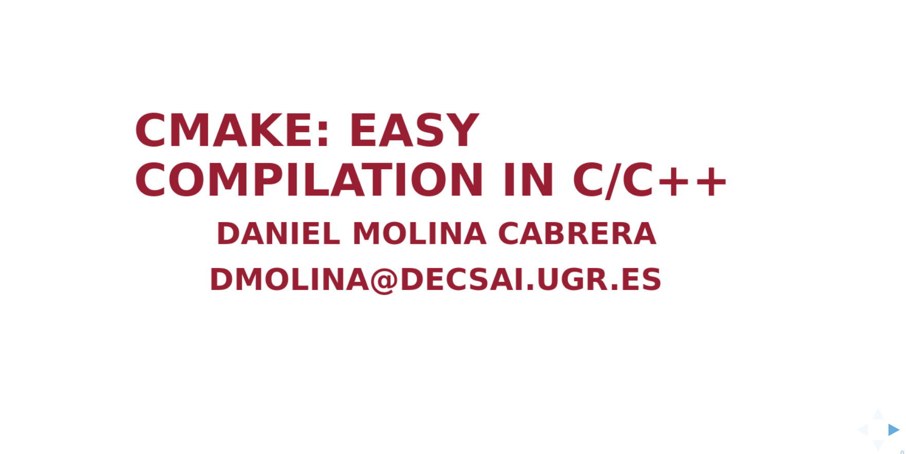
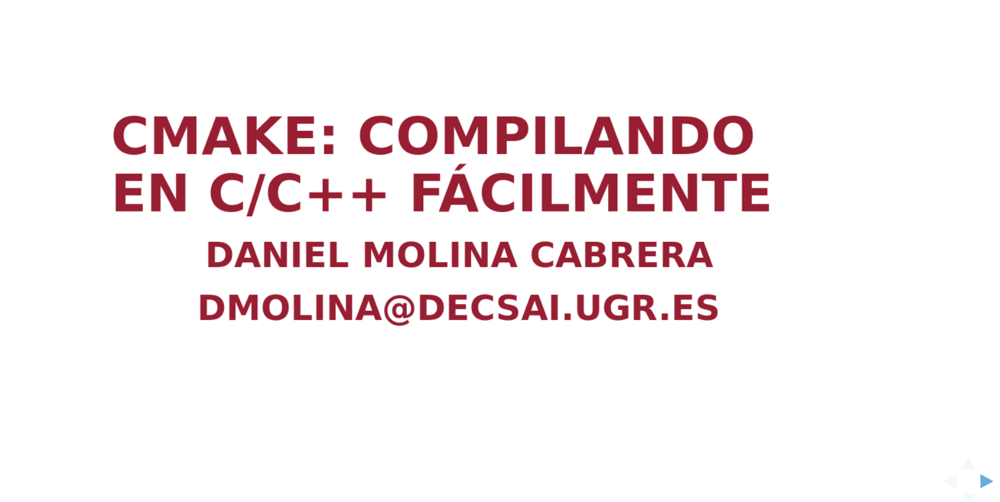

# README #

This repository contains slides from a short introduction about
[CMake](https://cmake.org/).

There are two versions: In spanish and in english. 

The english version is:

And the Spanish version: 

